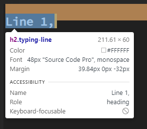

# My css hacks and tricks
- ##### Give me the credits, please.
- ##### [Portuguese Translation](../README-PT-PTBR.md)

## What is it?

It is a mini-project to animate Header text mainly, without line of JavaScript. You can use it in your project, just pasting in your code. Read the [MIT License](LICENSE) to more info!


## Content Table

+ Use the top-left menu to the left of the title README.md or this links bellow:
----


## Why use it?

> This is a ready-made code, prepared and under the MIT license, i.e. you don't need to be bound by a certain license or copyright. **The only thing I ask for is the credits in a footer of the page used,** with the [link to my github](https://github.com/RickBarretto). The code already comes with [parameters](#paramenters) to edit without further headaches and with an [explanation of how it works](#explanation).

## How to use it
1. Use the structure :
   1. ```html
        <div class="typing-container">
            <h2 class="typing-line">Line 1, abcdeft</h2>
            <h2 class="typing-line">Line 2,</h2>
            <h2 class="typing-line">Line 3, hehe!</h2>
        </div>
      ```
   2. You can change the heading for a other heading tag. And the div's class for another, but you must change the class/element in the css code.
2. Copy and paste the `typing.css` to you Css Folder in your project.
3. Add the `<link rel="stylesheet" href="css-folder/typing.css">` in you html's head or add `@import url(../css-folder/typing.css)` in your main css file. 
4. Remove the `body` style in the `typing.css`;
5. Change the content, and in `:root`:
   1. Change the colors, font-size, cursor... (if do you want)
   2. Change the start time: `--time-to-start`
   3. Change the line width, duration and the range.

> In this moment, ou must to be confused in the third topic about the :root parameters. But here is a explanation:
> 
> `--line<position>-width:` is the width of the content. See the [How to find the content width?](#how-to-find-the-content-width)
>
> `--line<position>-range:` is the line's number of words.
> 
> `--line<position>-time:` is the time of animation. I recommend that the time be equal to range divided by 10 in seconds. Like: `range = 13, so time = 1.3s`
> 

## Explanation
### Behind the code
+ The first line starts before the `--time-to-start`
+ So the blink animation runs with the width animation
  + The width animation was made in steps, this steps are the `--line<position>-range`.
+ Before this, is executed the next line
+ The first line must to have a not transparent `border-rigth`, unlike the others, that must be a solid color;
+ The last line don't have a `cursor-disabled` animation, it must be infinite.

### How to find the content width?
1. Set `fit-content` in `--line<number>-width`
2. Open your browser `Inspect Tool - Dev Tools`.
   1. `Ctrl + Shift + I`, or `Mouse-Rigth-Button > Inspect` or `Menu > More tools > Dev Tools`
3. With your Inspect Tool, see the width:
   1. 
4. Soo, paste in the `--line<number>-width: fit-content;` the rigth width, but use only the integer part and add 1px.

## Paramenters

+ --font-size: size;
+ --font-color: color;
+ --line-aproximate: size;
+ --cursor-color: color;
+ --cursor-size: size;
+ --time-to-start: time;
+ --linex-width: size;
+ --linex-range: int;
+ --linex-time: time;


